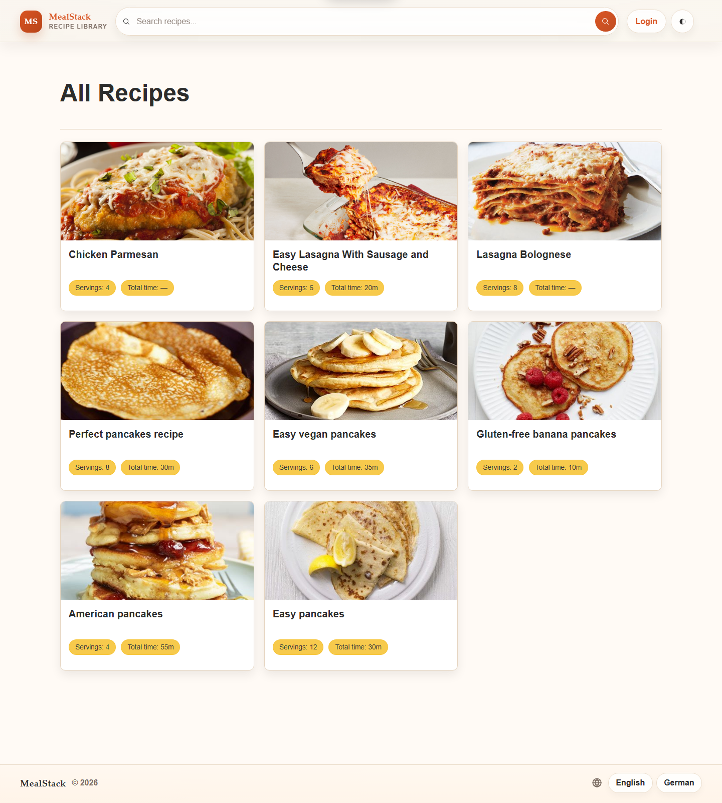
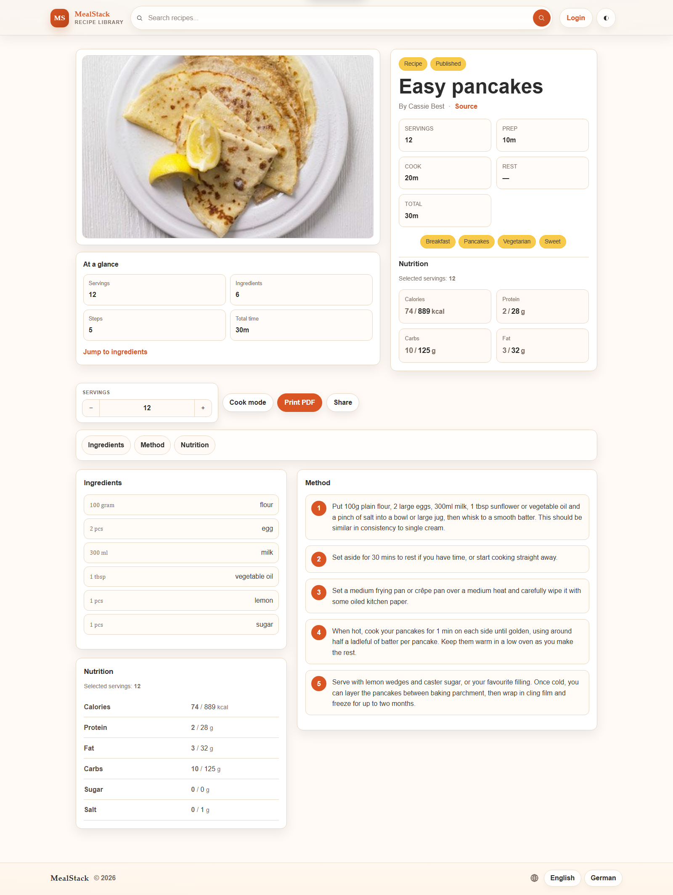

# 🍲 Meal Stack


## 📖 Description

Meal Stack is a Django recipe web application for managing, organizing, and sharing cooking recipes.
It supports recipe search, tagging, categories, localized UI text, OIDC login, recipe scrapers, admin bulk actions, and a refined recipe detail experience with cook mode, print export, serving adjustments, and share links.

## 📌 Features

- Create, edit, and manage recipes
- Search recipes, ingredients, tags, and categories
- Browse recipes in a compact list layout and a polished detail view
- Adjust servings and recalculate displayed values
- Use cook mode for a compact, focused reading experience
- Export styled recipe PDFs for printing or saving
- Share recipe URLs, including the current serving selection
- Manage ingredients, units, tags, categories, and importers in the admin
- Bulk update recipe status between draft and published in the admin
- Sign in with OIDC or use the built-in login
- Import ingredients from OpenFoodFacts
- Import recipes from Chefkoch, BBC Good Food, and Epicurious
- Run ingredient imports from the CLI with `ingredient_importer`
- Run recipe imports from the CLI with `recipe_importer`
- Use light and dark themes

## 📷 Preview

<p>
  
  <br><br>
  
</p>

## 🚀 Quick Start

### 1. Clone and configure

```bash
git clone https://github.com/TrickShotMLG02/MealStack.git
cd MealStack
cp .env.example .env
```

Adjust `.env` for your local setup. If you use Docker Compose, review `docker-compose.env` as well.

### 2. Install dependencies

Meal Stack uses `uv`:

```bash
uv python install
uv sync
```

### 3. Run migrations

```bash
uv run python manage.py migrate
```

### 4. Seed demo data

Run all seeds at once:

```bash
uv run python manage.py seed_all
```

Or run individual seeds:

```bash
uv run python manage.py seed_admin_user
uv run python manage.py seed_tags
uv run python manage.py seed_units
uv run python manage.py seed_ingredients
uv run python manage.py seed_recipe
```

### 5. Run the development server

```bash
uv run python manage.py runserver
```

Open:

- App: http://127.0.0.1:8000/
- Admin: http://127.0.0.1:8000/admin/

Default seed login:

- User: `admin`
- Password: `admin`

## Tests and coverage

Most of the time this is enough:

```bash
uv run python manage.py test --keepdb
```

The test runner uses a local SQLite test database by default, even if your `.env` points at MySQL.
That keeps local test runs fast and avoids needing extra database permissions for `test_*`
databases. It also shows a progress bar and a short summary at the end.

For coverage reports, install the dev dependencies first:

```bash
uv sync --dev
```

Then run:

```bash
uv run python manage.py test_coverage --keepdb
```

This runs the suite once and reports app-only coverage for `apps/`. Tests, migrations, and test
helpers are not counted.

For a more detailed report, add `--per-test`:

```bash
uv run python manage.py test_coverage --keepdb --per-test
```

This is slower, but useful when checking what a single test actually covers. Each test is measured
against the app files it touched, not against the whole project.

Common flags:

| Option | Description |
| --- | --- |
| `--keepdb` | Reuse the test database between runs. Usually worth using locally. |
| `--per-test` | Add the slower per-test touched-file coverage table. |
| `--no-progress` | Hide progress bars. With `manage.py test`, this falls back to Django's dot output. |
| `--no-color` | Disable colored output. |
| `--configured-database` | For `test_coverage`, use the database from the active Django settings instead of isolated SQLite. |
| `--pattern "test*.py"` | Use a different test discovery pattern. |

You can limit coverage runs with normal Django test labels:

```bash
uv run python manage.py test_coverage apps.recipes.tests.test_recipe_list_search --keepdb
uv run python manage.py test_coverage apps.recipes.tests.test_unit_model.UnitModelTests --keepdb --per-test
```

Failed and skipped tests are shown in the summary. In `--per-test` mode, one failed test does not
stop the remaining tests from being measured.

If you really want `manage.py test` to use the database from `.env`, set:

```bash
USE_CONFIGURED_TEST_DATABASE=true
```

## 🐳 Docker Compose

The repository includes `docker-compose.yml` for local stack usage.

```bash
docker compose up --build
```

Compose uses:

- `.env` for application settings
- `docker-compose.env` for Compose-specific and stack-specific overrides

### 📦 Portainer

Portainer stacks cannot use `build:` for remote deployments. Build and push the image first, then replace the `build:` block with one of the published images:

- `trickshotmlg/mealstack:latest`
- `trickshotmlg/mealstack:dev`

For Portainer, comment out the active `env_file` block and provide stack variables through `stack.env`.

## 🐳 Docker Images

You can also run Meal Stack directly from Docker Hub:

```bash
docker run --env-file .env -p 8000:8000 trickshotmlg/mealstack:latest
```

Development image:

```bash
docker run --env-file .env -p 8000:8000 trickshotmlg/mealstack:dev
```

## 🤝 Contributing

Contributions are welcome.

- Check the [Contribution Issue](https://github.com/TrickShotMLG02/MealStack/issues/1) to get started.
- Fork the repo, make your changes, and submit a pull request.

## 🤖 AI Usage

This repository was founded and built by hand without AI tools.

AI was used selectively for:

- refactoring support
- idea generation
- complex implementation work such as fuzzy search
- web design and UI refinement
- debugging help
- README generation and rewording

AI-assisted changes were always reviewed, adapted where needed, and integrated deliberately. Nothing was copied blindly into the codebase.

## 📄 License

This project is licensed under the [GNU General Public License v3 (GPL-3.0)](LICENSE).
You are free to use, modify, and distribute this software under the terms of the GPL-3.0, which requires that any distributed modifications or derivative works also be open source.

Please give credit to the original authors when using or modifying this project.
